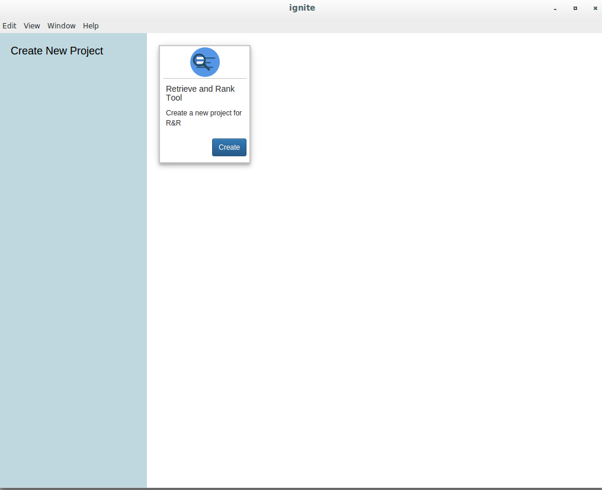
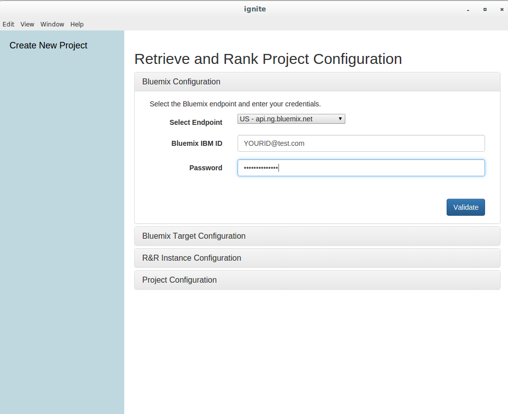
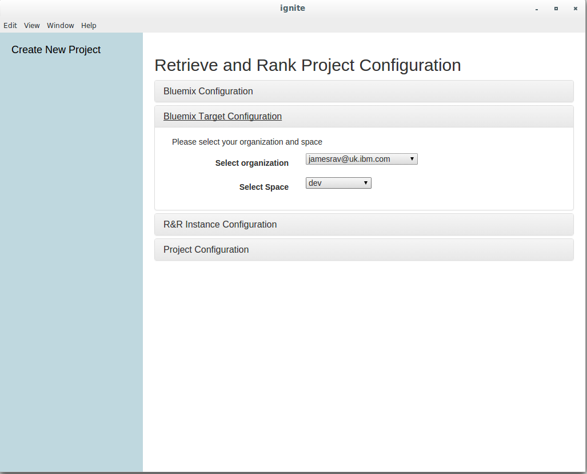
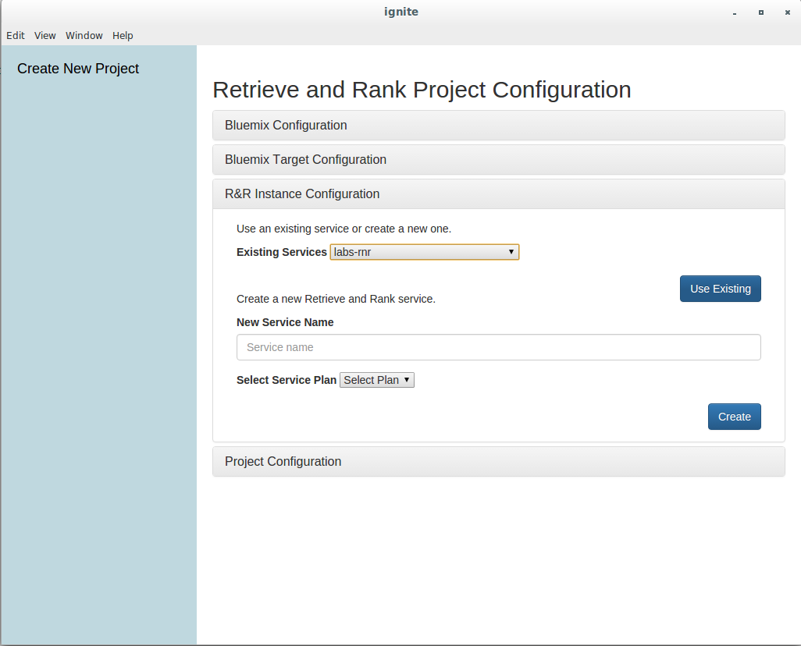
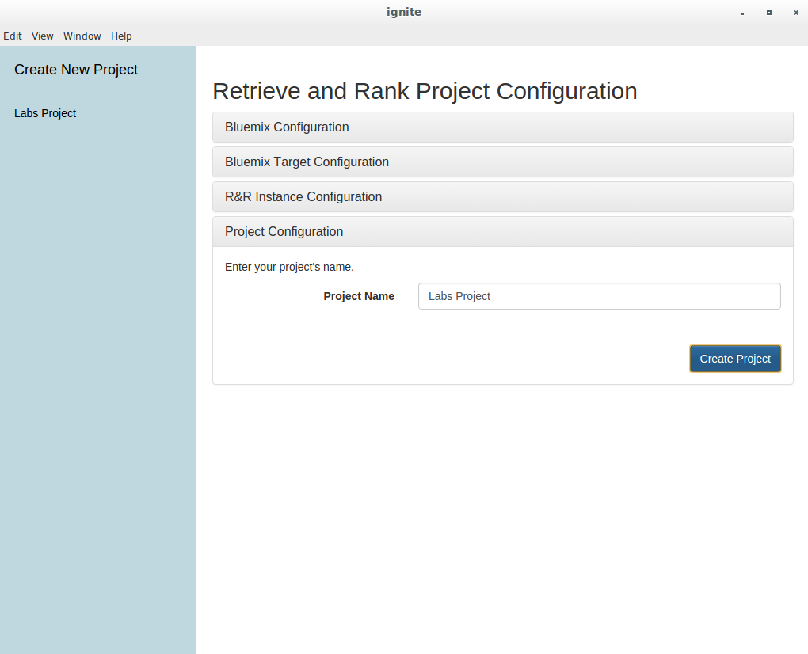
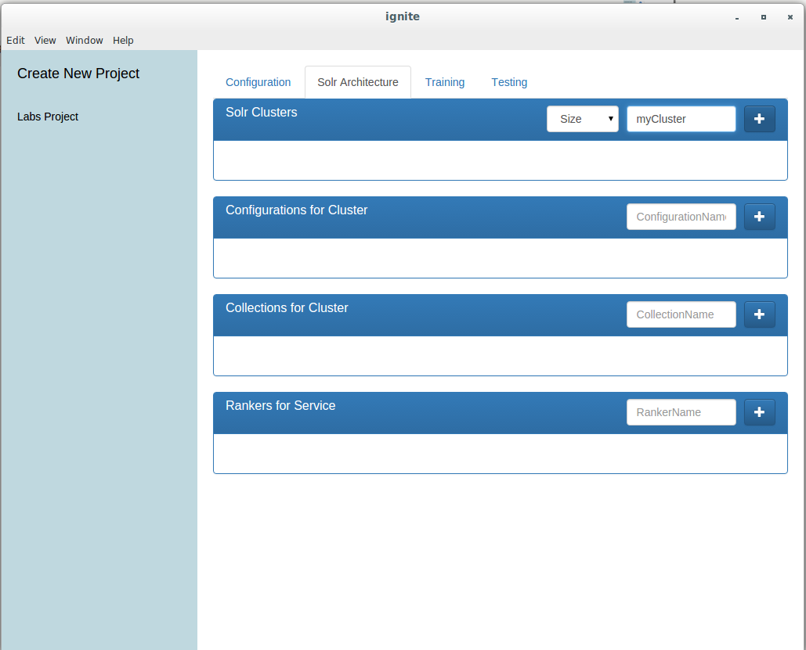
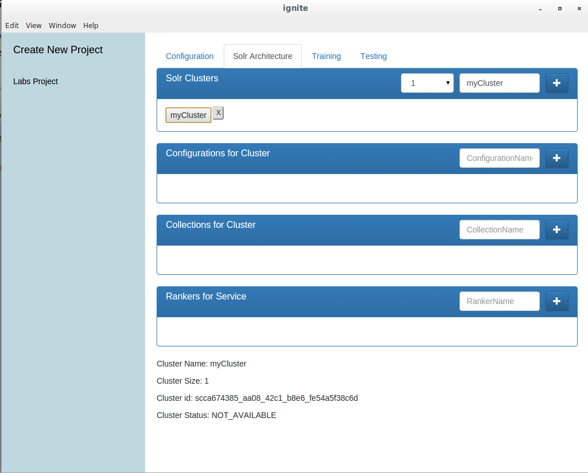
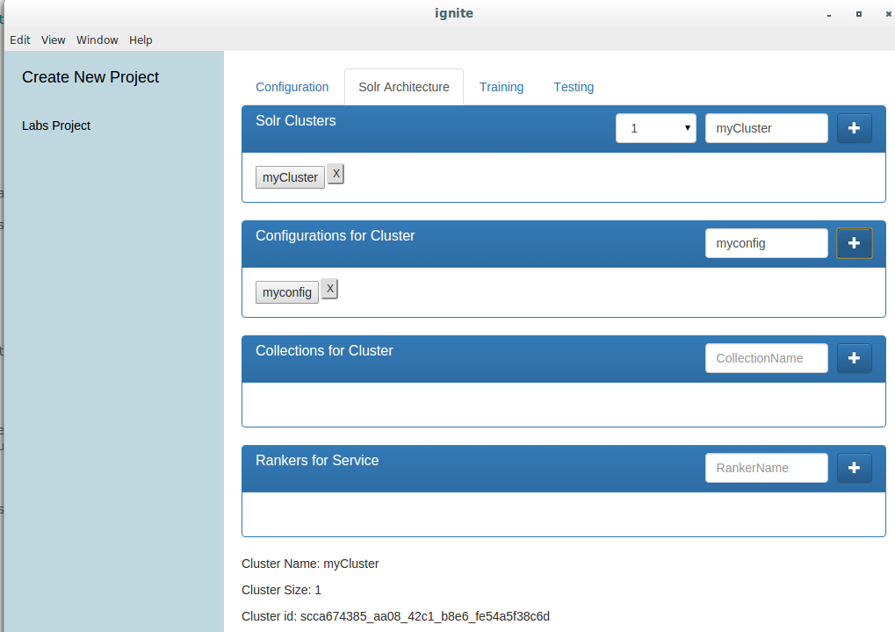
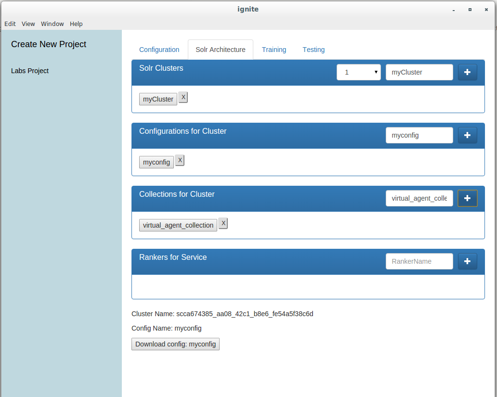
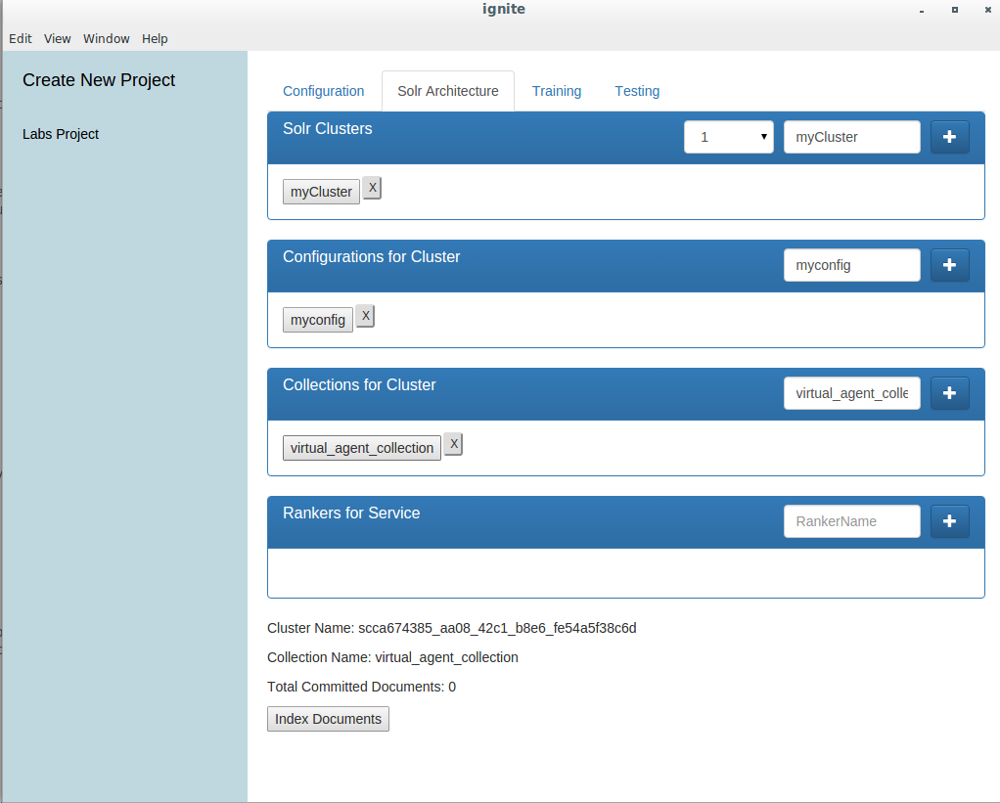

# Using Ignite Tooling

## Install the tool

You must have git, node and npm installed on your system. To install the R&R tool simply run

        git clone https://github.com/cognitive-catalyst/ignite-electron
        cd ignite-electron
        npm install
    
    
## Set up your project

  1. Start the application by running `npm start`. You should see a screen that looks like the following:
  
  
  
  Click on the blue "Create" button for Retrieve and Rank
  
  2. You will be presented with a set of collapsed tabs with "Bluemix Configuration" expanded. You should follow the wizard, at each stage providing the required information. When you get to "R&R instance configuration" remember to select and use our existing instance that we set up for this lab.
  
  
  
  
  
  
  3. Once you have entered a project name, your project will appear on the left side. Click on it to be shown a summary of the instance information. Open the Solr Architecture tab - this is where most of our work will take place.
  
## Creating a cluster

Once you have set up your project, create an R&R cluster. Simply enter a name and select a size from the dropdown - bigger clusters are more expensive but support a higher retrieve throughput. For the purpose of this exercise, a cluster size of 1 should suffice.

Once you have created your cluster, it should appear as a grey box in the list and its ID and status at the bottom of the page

*You should now refer back to the main instruction set to help you configure the schema.*

## Creating a configuration

Once you have made relevent changes to your schema.xml and updated the config zip file with the most recent version of the schema, you can upload your config via the ignite tool. 

1. From the Solr Architecture tab, select the cluster you wish to upload your config to. The name, status and cluster ID for that cluster should appear in the bottom of the window.

2. In the "Configurations for clusters" section, enter a name for the config and click the '+' button. You will be prompted to select a file. Select the zip file you have just created. The config will now be uploaded to SOLR and appear in the box.

## Creating a collection

1. Select the configuration that you want to use for your collection (created in the steps above) by clicking on it.
2. Enter a name for your new collection (for this exercise, you should use 'virtual_agent_collection' but in future you can customise this) and click the '+' button. The collection should appear in the relevant box below.

## Populating a collection (indexing documents)

Once you have created a collection, you need to upload content to be indexed. 

1. Select the collection you want to add content to and then click on "Index Documents" at the bottom of the screen. 

2. You will be presented with a file dialog, select the JSON document to be indexed 'fda_medwatch_docs.json'

3. A popup will appear to tell you that the upload has started and a second popup will appear when the indexing process is complete.

